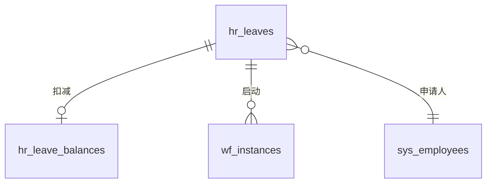
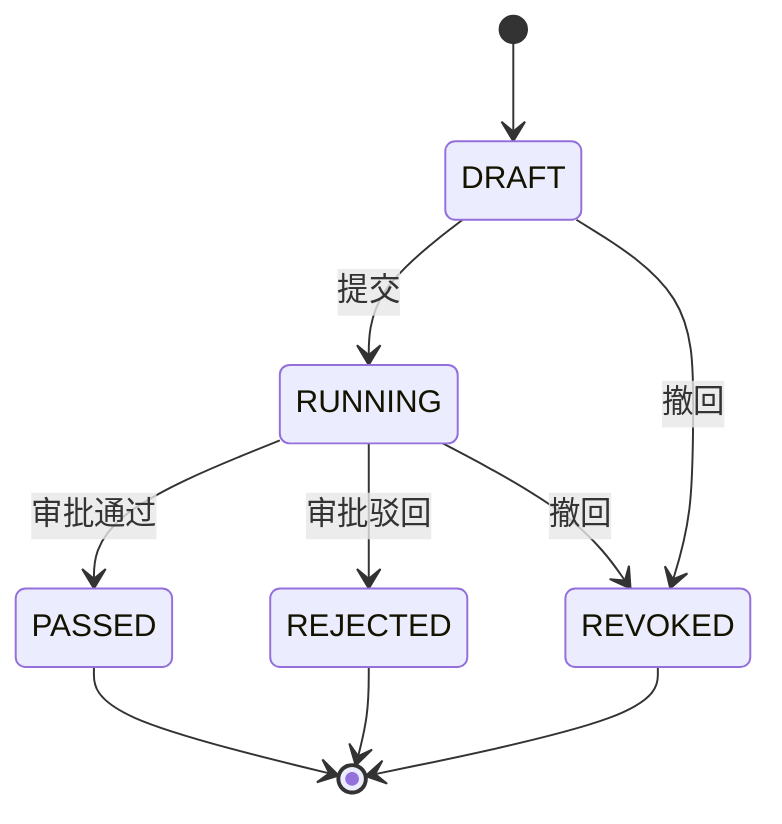

# 05-modules/TEMPLATE - 模块详细设计标准模板

> 日期: 2026-06-04
> 用途: **所有 13 份业务模块详细设计必须按本模板组织**
> 实例参考: `05-platform-common.md`

---

## 0. 文档头

每个模块详细设计必须以以下格式开头：

```markdown
# 05-modules/{NN}-{module-name} - {模块名} 模块详细设计

> 版本: v2.0-draft
> 日期: 2026-06-04
> 状态: **Phase 1 设计中**
> 前置阅读: 00-index.md, 01-architecture.md, 02-database.md, 03-api-spec.md
> 关联模块: 列出依赖的其他模块详细设计
```

---

## 1. 模块定位

| 项目 | 内容 |
|------|------|
| Maven artifactId | `oa-{module}` |
| 包名 | `cn.oa.{module}` |
| 职责 | 一句话描述 |
| 依赖 | 列出 Maven 依赖的其他模块 |
| 被依赖 | 列出哪些模块依赖本模块 |

---

## 2. 目录结构

```
oa-{module}/
├── pom.xml
└── src/
    ├── main/
    │   ├── java/cn/oa/{module}/
    │   │   ├── controller/        # REST Controller
    │   │   │   └── {Module}{Resource}Controller.java
    │   │   ├── service/           # 业务 Service
    │   │   │   ├── {Module}{Resource}Service.java
    │   │   │   └── impl/
    │   │   │       └── {Module}{Resource}ServiceImpl.java
    │   │   ├── manager/           # 横切 Manager (可选)
    │   │   │   └── {Module}{Resource}Manager.java
    │   │   ├── mapper/            # MyBatis-Plus Mapper
    │   │   │   ├── {Module}{Resource}Mapper.java
    │   │   │   └── xml/
    │   │   │       └── {Module}{Resource}Mapper.xml
    │   │   ├── entity/            # Entity (PO)
    │   │   │   └── {Module}{Resource}.java
    │   │   ├── dto/               # DTO (入参)
    │   │   │   ├── {Module}{Resource}CreateDTO.java
    │   │   │   ├── {Module}{Resource}UpdateDTO.java
    │   │   │   ├── {Module}{Resource}QueryDTO.java
    │   │   │   └── ...
    │   │   ├── vo/                # VO (出参)
    │   │   │   ├── {Module}{Resource}VO.java
    │   │   │   ├── {Module}{Resource}ListVO.java
    │   │   │   └── ...
    │   │   ├── bo/                # 内部业务对象
    │   │   │   └── ...
    │   │   ├── enums/             # 业务枚举
    │   │   │   ├── {Resource}TypeEnum.java
    │   │   │   ├── {Resource}StatusEnum.java
    │   │   │   └── ...
    │   │   ├── constant/          # 模块常量
    │   │   │   └── {Module}Constants.java
    │   │   ├── callback/          # 工作流回调 (可选)
    │   │   │   └── {Module}WfCallback.java
    │   │   ├── event/             # 业务事件 (可选)
    │   │   │   └── ...
    │   │   ├── exception/         # 模块业务异常
    │   │   │   └── {Module}BizException.java
    │   │   └── config/            # 模块配置 (可选)
    │   │       └── {Module}Config.java
    │   └── resources/
    │       ├── mapper/            # MyBatis XML
    │       │   └── {Module}{Resource}Mapper.xml
    │       └── META-INF/
    │           └── spring/
    │               └── org.springframework.boot.autoconfigure.AutoConfiguration.imports
    └── test/
        ├── java/cn/oa/{module}/
        │   ├── controller/        # Controller 测试 (@WebMvcTest)
        │   │   └── {Module}{Resource}ControllerTest.java
        │   ├── service/           # Service 单元测试
        │   │   └── {Module}{Resource}ServiceTest.java
        │   ├── mapper/            # Mapper 集成测试 (Testcontainers)
        │   │   └── {Module}{Resource}MapperIT.java
        │   ├── api/               # API 集成测试 (Testcontainers + MockMvc)
        │   │   └── {Module}{Resource}ApiIT.java
        │   └── util/              # 测试工具
        │       └── TestDataFactory.java
        └── resources/
            ├── application-test.yml
            └── data/              # 测试数据 (JSON/SQL)
                └── ...
```

---

## 3. 数据模型

### 3.1 表清单
列出本模块的所有表（与 `02-database.md` 对齐）。

### 3.2 表结构
每张表必须详细列出：
- 字段名/类型/默认值/注释
- 索引（PK/UK/普通）
- 业务约束（CHECK 条件、应用层校验）

### 3.3 ER 图
用 mermaid 描述实体关系。



### 3.4 状态机
用 mermaid stateDiagram 描述状态流转。



---

## 4. 业务规则

### 4.1 关键规则清单

| # | 规则 | 实现位置 | 备注 |
|---|------|----------|------|
| R1 | 请假天数 < 余额 | `HrLeaveServiceImpl.checkBalance` | 抛 `HL002` |
| R2 | 请假日期不重叠 | `HrLeaveServiceImpl.checkOverlap` | 抛 `HL003` |
| R3 | 病假 > 3 天需附件 | `HrLeaveServiceImpl.checkAttachment` | 抛 `HL004` |
| R4 | ... | ... | ... |

### 4.2 业务规则详细说明

**R1: 请假天数 < 余额**
- 触发：提交请假时
- 检查：请假天数 vs 假期余额的 `availableDays`
- 异常：余额不足时抛 `BizException(HL002, "余额不足")`
- 备注：余额并发扣减用 `OptimisticLockerInnerInterceptor`

---

## 5. 接口清单

### 5.1 路径规范
- 前缀：`/api/v1/{module}/{resource-plural}`
- 权限码：`{module}:{resource}:{action}`

### 5.2 接口表

| # | 操作 | 路径 | 方法 | 权限 | 数据范围 | 状态 |
|---|------|------|------|------|----------|------|
| 1 | 创建请假 | `/api/v1/hr-leave/leaves` | POST | `hr-leave:leave:create` | SELF | ✓ |
| 2 | 列表（管理） | `/api/v1/hr-leave/leaves` | GET | `hr-leave:leave:list` | DEPT_DOWN | ✓ |
| 3 | 详情 | `/api/v1/hr-leave/leaves/{id}` | GET | `hr-leave:leave:view` | SELF/DEPT_DOWN | ✓ |
| 4 | 撤回 | `/api/v1/hr-leave/leaves/{id}/actions/revoke` | POST | `hr-leave:leave:revoke` | SELF | ✓ |
| 5 | 重新提交 | `/api/v1/hr-leave/leaves/{id}/actions/resubmit` | POST | `hr-leave:leave:resubmit` | SELF | ✓ |
| 6 | 我的余额 | `/api/v1/hr-leave/balances/me` | GET | `hr-leave:leave-balance:view` | SELF | ✓ |
| 7 | 余额列表 | `/api/v1/hr-leave/balances` | GET | `hr-leave:leave-balance:list` | DEPT_DOWN | ✓ |
| 8 | 初始化余额 | `/api/v1/hr-leave/balances/actions/init` | POST | `hr-leave:leave-balance:init` | DEPT | ✓ |
| 9 | 调整余额 | `/api/v1/hr-leave/balances/{id}/adjustments` | POST | `hr-leave:leave-balance:adjust` | DEPT | ✓ |
| 10 | 规则列表 | `/api/v1/hr-leave/rules` | GET | `hr-leave:leave-rule:list` | COMPANY | ✓ |
| 11 | 更新规则 | `/api/v1/hr-leave/rules/{id}` | PUT | `hr-leave:leave-rule:update` | COMPANY | ✓ |

### 5.3 接口详情
**接口 1：创建请假**
- **路径**: `POST /api/v1/hr-leave/leaves`
- **权限**: `hr-leave:leave:create`
- **数据范围**: SELF（自动取当前用户）
- **请求 DTO**: `HrLeaveCreateDTO`
  ```json
  {
    "leaveType": "ANNUAL",
    "startTime": "2026-06-10T09:00:00",
    "endTime": "2026-06-12T18:00:00",
    "leavePeriod": "FULL",
    "reason": "回老家",
    "attachments": ["file-id-1", "file-id-2"]
  }
  ```
- **校验规则**:
  - `leaveType` 必填，必须在 HrLeaveTypeEnum 9 个值中
  - `startTime` 必填，不能早于当前时间
  - `endTime` 必填，必须晚于 startTime
  - `days` 由后端计算（前端可显示但后端不信任）
  - `reason` 必填，1-500 字
  - `attachments` 可选，病假 > 3 天必须有
- **业务校验**:
  - 余额检查
  - 日期重叠检查
  - 规则校验（附件、最小天数、最大天数）
- **响应**: `R<{id: number, applyNo: string, days: number}>`
- **业务逻辑**:
  1. 校验入参
  2. 计算 days（按工作日 × 时段系数）
  3. 校验余额
  4. 校验日期重叠
  5. 校验规则
  6. 插入 hr_leaves (status=DRAFT, wf_instance_id=NULL)
  7. 启动工作流（`wfDefinitionBizType='HR_LEAVE'`）
  8. 更新 hr_leaves (wf_instance_id=...)
  9. 返回结果
- **错误码**（通过 `BizException(RCode, "消息")` 抛出）:
  - 假期类型无效
  - 余额不足
  - 请假日期重叠
  - 违反请假规则（缺附件/超限/不满足最小单位）
  - 找不到审批人

---

## 6. 错误码

| 编码 | 名称 | 描述 | HTTP |
|------|------|------|------|
| - | (本模块错误码) | 通过 BizException 抛出，消息为中文可读文本 | - |
| - | INVALID_LEAVE_TYPE | 假期类型无效 | 422 |
| - | INSUFFICIENT_BALANCE | 余额不足 | 422 |
| - | LEAVE_OVERLAP | 请假日期重叠 | 409 |
| - | LEAVE_RULE_VIOLATION | 违反请假规则 | 422 |
| - | LEAVE_STATUS_INVALID | 状态不允许该操作 | 409 |
| - | BALANCE_NOT_FOUND | 余额不存在 | 404 |
| `HL007` | RULE_NOT_FOUND | 规则不存在 | 404 |
| `HL008` | ATTACHMENT_REQUIRED | 缺少附件 | 422 |

---

## 7. 权限与数据权限

### 7.1 权限码
（参考 §5.2）

### 7.2 数据范围
| 角色 | 范围 |
|------|------|
| ADMIN | ALL |
| HR | DEPT_DOWN |
| MANAGER | DEPT_DOWN（看本部门及下级）|
| EMPLOYEE | SELF（看自己） |

### 7.3 接口级数据范围
（参考 §5.2 第 5 列）

---

## 8. 工作流接入

### 8.1 流程定义
- bizType: `HR_LEAVE`
- 默认定义: `WF_LEAVE_V1`（DEPT_MANAGER 审批）

### 8.2 启动
```java
wfService.startProcess("HR_LEAVE", leaveId, dto);
```

### 8.3 回调
实现 `WfCallback` 接口：

```java
@Component
public class HrLeaveWfCallback implements WfCallback {
    @Override
    public void onInstanceEnded(WfCallbackContext ctx) {
        if (!"HR_LEAVE".equals(ctx.getBusinessType())) return;
        // 业务处理
    }
}
```

---

## 9. 前端调用

### 9.1 API 路径
（与 §5.2 一致）

### 9.2 页面
| 路径 | 用途 | 权限 |
|------|------|------|
| `/hr-leave/my-leave` | 我的请假 | `hr-leave:leave:list` |
| `/hr-leave/apply` | 请假申请 | `hr-leave:leave:create` |
| `/hr-leave/approval` | 请假审批（待办集成） | `workflow:task:list` |
| `/hr-leave/my-balance` | 我的余额 | `hr-leave:leave-balance:view` |
| `/hr-leave/balance-manage` | 余额管理 | `hr-leave:leave-balance:list` |
| `/hr-leave/rule-manage` | 规则管理 | `hr-leave:leave-rule:list` |

### 9.3 关键组件
- `LeaveForm` 请假表单
- `LeaveApprovalFlow` 审批流
- `LeaveCalendar` 请假日历

---

## 10. 测试计划

### 10.1 单元测试
- 覆盖率目标: Service 层 > 80%
- 用例数: 每个 Service 至少 10 个
- 工具: JUnit 5 + Mockito

### 10.2 集成测试
- Testcontainers MySQL + Redis
- 用例数: 每个 Controller 至少 5 个 happy path
- 验证：HTTP 状态码、响应结构、数据库状态

### 10.3 E2E 测试
- Playwright
- 关键场景:
  - 员工提交请假 → 经理审批 → 请假完成
  - 余额扣减正确性
  - 病假超过 3 天强制附件

### 10.4 性能测试
- 列表接口 < 500ms
- 创建接口 < 1s

---

## 11. 实施任务清单

> 从模板生成具体任务，便于分阶段实施

### 11.1 Phase 2 - 数据库
- [ ] V 迁移脚本
- [ ] seed 数据

### 11.2 Phase 2 - 实体/Mapper
- [ ] Entity (PO)
- [ ] DTO/VO
- [ ] Mapper + XML
- [ ] Enums

### 11.3 Phase 3 - 业务逻辑
- [ ] Service 接口
- [ ] ServiceImpl
- [ ] 业务规则实现
- [ ] 工作流回调

### 11.4 Phase 3 - API
- [ ] Controller
- [ ] 权限校验
- [ ] 数据范围
- [ ] OpenAPI 注解

### 11.5 Phase 3 - 测试
- [ ] 单元测试
- [ ] 集成测试
- [ ] API 测试

### 11.6 Phase 3 - 前端
- [ ] API 客户端
- [ ] Store
- [ ] 页面
- [ ] 表单/列表组件

### 11.7 Phase 3 - Review
- [ ] Code review checklist
- [ ] 性能 review
- [ ] 安全 review
- [ ] 文档 review

---

## 12. 验收标准

- [ ] 所有 §3 表已建
- [ ] 所有 §5 接口已实现
- [ ] 所有 §6 错误码已实现
- [ ] §7 权限/数据范围正确
- [ ] §8 工作流正确
- [ ] §9 前端可调用
- [ ] §10 测试通过
- [ ] §11 任务全部完成
- [ ] 单元测试覆盖率 > 80%
- [ ] 集成测试通过
- [ ] E2E 关键场景通过
- [ ] OpenAPI 文档完整
- [ ] 代码 review 通过
- [ ] 性能指标达标
